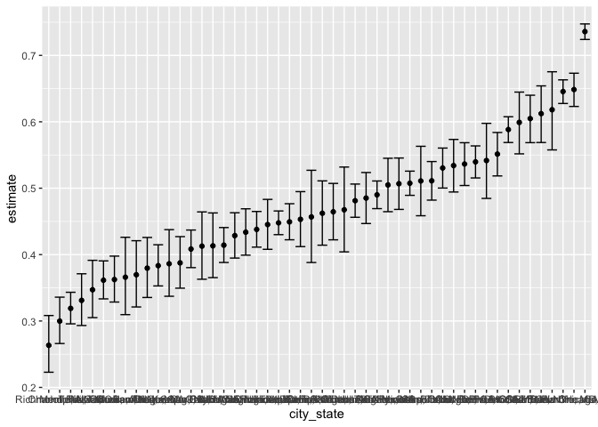

p8105_HW5_yk2959
================
Kiran Kui
2022-11-12

``` r
library(tidyverse)
```

    ## ── Attaching packages ─────────────────────────────────────── tidyverse 1.3.2 ──
    ## ✔ ggplot2 3.3.6     ✔ purrr   0.3.4
    ## ✔ tibble  3.1.8     ✔ dplyr   1.0.9
    ## ✔ tidyr   1.2.0     ✔ stringr 1.4.1
    ## ✔ readr   2.1.2     ✔ forcats 0.5.2
    ## ── Conflicts ────────────────────────────────────────── tidyverse_conflicts() ──
    ## ✖ dplyr::filter() masks stats::filter()
    ## ✖ dplyr::lag()    masks stats::lag()

``` r
library(readxl)
library(dplyr)
library(purrr)
library(ggplot2)
library(stringr)
```

# Problem 2

``` r
homicide_df = read_csv("./data/homicide-data.csv") %>%
  janitor::clean_names() 
```

    ## Rows: 52179 Columns: 12
    ## ── Column specification ────────────────────────────────────────────────────────
    ## Delimiter: ","
    ## chr (9): uid, victim_last, victim_first, victim_race, victim_age, victim_sex...
    ## dbl (3): reported_date, lat, lon
    ## 
    ## ℹ Use `spec()` to retrieve the full column specification for this data.
    ## ℹ Specify the column types or set `show_col_types = FALSE` to quiet this message.

``` r
skimr::skim(homicide_df)
```

|                                                  |             |
|:-------------------------------------------------|:------------|
| Name                                             | homicide_df |
| Number of rows                                   | 52179       |
| Number of columns                                | 12          |
| \_\_\_\_\_\_\_\_\_\_\_\_\_\_\_\_\_\_\_\_\_\_\_   |             |
| Column type frequency:                           |             |
| character                                        | 9           |
| numeric                                          | 3           |
| \_\_\_\_\_\_\_\_\_\_\_\_\_\_\_\_\_\_\_\_\_\_\_\_ |             |
| Group variables                                  | None        |

Data summary

**Variable type: character**

| skim_variable | n_missing | complete_rate | min | max | empty | n_unique | whitespace |
|:--------------|----------:|--------------:|----:|----:|------:|---------:|-----------:|
| uid           |         0 |             1 |   9 |  10 |     0 |    52179 |          0 |
| victim_last   |         0 |             1 |   1 |  20 |     0 |    12687 |          0 |
| victim_first  |         0 |             1 |   1 |  28 |     0 |    16640 |          0 |
| victim_race   |         0 |             1 |   5 |   8 |     0 |        6 |          0 |
| victim_age    |         0 |             1 |   1 |   7 |     0 |      102 |          0 |
| victim_sex    |         0 |             1 |   4 |   7 |     0 |        3 |          0 |
| city          |         0 |             1 |   5 |  14 |     0 |       50 |          0 |
| state         |         0 |             1 |   2 |   2 |     0 |       28 |          0 |
| disposition   |         0 |             1 |  14 |  21 |     0 |        3 |          0 |

**Variable type: numeric**

| skim_variable | n_missing | complete_rate |        mean |         sd |          p0 |         p25 |         p50 |         p75 |          p100 | hist  |
|:--------------|----------:|--------------:|------------:|-----------:|------------:|------------:|------------:|------------:|--------------:|:------|
| reported_date |         0 |             1 | 20130899.16 | 1123419.63 | 20070101.00 | 20100318.00 | 20121216.00 | 20150911.00 | 201511105\.00 | ▇▁▁▁▁ |
| lat           |        60 |             1 |       37.03 |       4.35 |       25.73 |       33.77 |       38.52 |       40.03 |         45.05 | ▁▅▅▇▅ |
| lon           |        60 |             1 |      -91.47 |      13.75 |     -122.51 |      -96.00 |      -87.71 |      -81.76 |        -71.01 | ▃▁▃▇▅ |

I have imported the homicide dataset from the github repository and
tidied the names of the variables in the dataset.

## Brief introduction of the raw homicide dataset

The raw dataset contains 52179 rows and 12 columns, with each row
representing a single record of homicide in 50 large U.S. cities.

Variables include, date of homicide, victim first and last name,
victims’ race, age, sex and the city/state that the homicide was
located, as well as the lattitude and longitude of the homicide
location, given in uid, reported_date, victim_last, victim_first,
victim_race, victim_age, victim_sex, city, state, lat, lon, disposition.

``` r
homicide_df_clean_1 = homicide_df %>% 
  unite(city_state, c(city, state), sep = ", ", remove = FALSE) %>% 
  group_by(city_state) %>% 
  summarise(
    total_homicide = sum(!is.na(uid)))

homicide_df_clean_2 = homicide_df %>% 
  mutate(
  unsolved = ifelse(
  disposition %in% c('Closed without arrest', 'Open/No arrest'), 1, 0)) %>% 
  unite(city_state, c(city, state), sep = ", ", remove = FALSE) %>% 
  group_by(city_state, unsolved) %>% 
  filter(unsolved == 1) %>% 
  summarise(total_unsolved = sum(!is.na(unsolved))) %>% 
  select(-unsolved)
```

    ## `summarise()` has grouped output by 'city_state'. You can override using the
    ## `.groups` argument.

``` r
homicide_df_clean = merge(homicide_df_clean_1, homicide_df_clean_2, by='city_state', all.x=TRUE) %>% 
  drop_na(total_unsolved)
```

I have created a city_state variable (e.g. “Baltimore, MD”) and then
summarize within cities to obtain the total number of homicides and the
number of unsolved homicides.

``` r
prop.test(
  homicide_df_clean %>%  filter(city_state == "Baltimore, MD") %>% pull(total_unsolved),
  homicide_df_clean %>%  filter(city_state == "Baltimore, MD") %>% pull(total_homicide)) %>% 
  broom::tidy()
```

    ## # A tibble: 1 × 8
    ##   estimate statistic  p.value parameter conf.low conf.high method        alter…¹
    ##      <dbl>     <dbl>    <dbl>     <int>    <dbl>     <dbl> <chr>         <chr>  
    ## 1    0.646      239. 6.46e-54         1    0.628     0.663 1-sample pro… two.si…
    ## # … with abbreviated variable name ¹​alternative

I used the prop.test function to estimate the proportion of homicides
that are unsolved, then saved the output of prop.test as an R object,
and apply the broom::tidy to this object and pull the estimated
proportion and confidence intervals from the resulting tidy dataframe.

The estimated proportion of unsolved homicides is 0.646 and the
confidence interval is (0.628, 0.663).

``` r
homicide_df_clean_tidy = 
  homicide_df_clean %>% 
  mutate(
    prop_test = map2(.x = total_unsolved, .y = total_homicide, ~ prop.test(x = .x, n = .y)),
    tidy_prop_test = map(.x = prop_test, ~ broom::tidy(.x))) %>%
  select(-prop_test) %>% 
  unnest(tidy_prop_test) %>% 
  select(city_state, estimate, conf.low,conf.high)

homicide_plot = homicide_df_clean_tidy %>% 
  mutate(city_state = fct_reorder(city_state, estimate)) %>% 
  ggplot(aes(x = city_state, y = estimate)) +
  geom_point() + 
  geom_errorbar(aes(ymin = conf.low, ymax = conf.high))
  theme(axis.text.x = element_text(angle = 90, vjust = 0.5, hjust = 1)) + 
  labs(
    title = "Showing the estimates of unsolved homicides and CIs",
    x = "city/state", 
    y = "estimates of proportion of unsolved homicide "
  )
```

    ## List of 4
    ##  $ axis.text.x:List of 11
    ##   ..$ family       : NULL
    ##   ..$ face         : NULL
    ##   ..$ colour       : NULL
    ##   ..$ size         : NULL
    ##   ..$ hjust        : num 1
    ##   ..$ vjust        : num 0.5
    ##   ..$ angle        : num 90
    ##   ..$ lineheight   : NULL
    ##   ..$ margin       : NULL
    ##   ..$ debug        : NULL
    ##   ..$ inherit.blank: logi FALSE
    ##   ..- attr(*, "class")= chr [1:2] "element_text" "element"
    ##  $ x          : chr "city/state"
    ##  $ y          : chr "estimates of proportion of unsolved homicide "
    ##  $ title      : chr "Showing the estimates of unsolved homicides and CIs"
    ##  - attr(*, "class")= chr [1:2] "theme" "gg"
    ##  - attr(*, "complete")= logi FALSE
    ##  - attr(*, "validate")= logi TRUE

``` r
homicide_plot
```

<!-- -->
