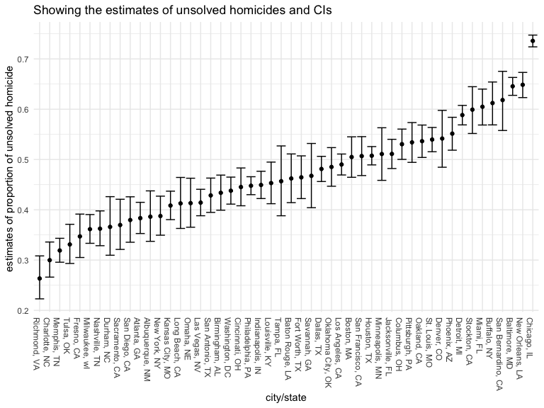
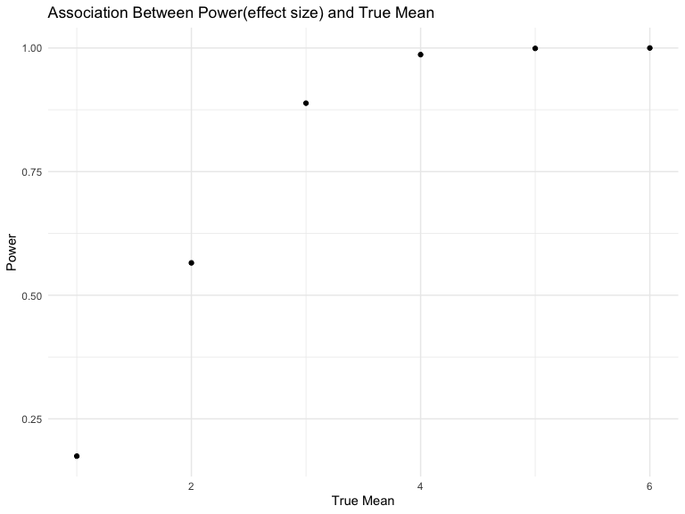

p8105_HW5_yk2959
================
Kiran Kui
2022-11-12

## Problem 1

I imported the data in individual spreadsheets contained in
`./data/zip_data/` by creating a dataframe that includes the list of all
files in that directory and the complete path to each file. Then, I
`map` over paths and import data using the `read_csv` function. Finally,
I `unnest` the result of `map`.

``` r
full_dataframe = 
  tibble(
    files = list.files("data/zip_data/"),
    path = str_c("data/zip_data/", files)
  ) %>% 
  mutate(data = map(path, read_csv)) %>% 
  unnest()
```

    ## Rows: 1 Columns: 8
    ## ── Column specification ────────────────────────────────────────────────────────
    ## Delimiter: ","
    ## dbl (8): week_1, week_2, week_3, week_4, week_5, week_6, week_7, week_8
    ## 
    ## ℹ Use `spec()` to retrieve the full column specification for this data.
    ## ℹ Specify the column types or set `show_col_types = FALSE` to quiet this message.
    ## Rows: 1 Columns: 8
    ## ── Column specification ────────────────────────────────────────────────────────
    ## Delimiter: ","
    ## dbl (8): week_1, week_2, week_3, week_4, week_5, week_6, week_7, week_8
    ## 
    ## ℹ Use `spec()` to retrieve the full column specification for this data.
    ## ℹ Specify the column types or set `show_col_types = FALSE` to quiet this message.
    ## Rows: 1 Columns: 8
    ## ── Column specification ────────────────────────────────────────────────────────
    ## Delimiter: ","
    ## dbl (8): week_1, week_2, week_3, week_4, week_5, week_6, week_7, week_8
    ## 
    ## ℹ Use `spec()` to retrieve the full column specification for this data.
    ## ℹ Specify the column types or set `show_col_types = FALSE` to quiet this message.
    ## Rows: 1 Columns: 8
    ## ── Column specification ────────────────────────────────────────────────────────
    ## Delimiter: ","
    ## dbl (8): week_1, week_2, week_3, week_4, week_5, week_6, week_7, week_8
    ## 
    ## ℹ Use `spec()` to retrieve the full column specification for this data.
    ## ℹ Specify the column types or set `show_col_types = FALSE` to quiet this message.
    ## Rows: 1 Columns: 8
    ## ── Column specification ────────────────────────────────────────────────────────
    ## Delimiter: ","
    ## dbl (8): week_1, week_2, week_3, week_4, week_5, week_6, week_7, week_8
    ## 
    ## ℹ Use `spec()` to retrieve the full column specification for this data.
    ## ℹ Specify the column types or set `show_col_types = FALSE` to quiet this message.
    ## Rows: 1 Columns: 8
    ## ── Column specification ────────────────────────────────────────────────────────
    ## Delimiter: ","
    ## dbl (8): week_1, week_2, week_3, week_4, week_5, week_6, week_7, week_8
    ## 
    ## ℹ Use `spec()` to retrieve the full column specification for this data.
    ## ℹ Specify the column types or set `show_col_types = FALSE` to quiet this message.
    ## Rows: 1 Columns: 8
    ## ── Column specification ────────────────────────────────────────────────────────
    ## Delimiter: ","
    ## dbl (8): week_1, week_2, week_3, week_4, week_5, week_6, week_7, week_8
    ## 
    ## ℹ Use `spec()` to retrieve the full column specification for this data.
    ## ℹ Specify the column types or set `show_col_types = FALSE` to quiet this message.
    ## Rows: 1 Columns: 8
    ## ── Column specification ────────────────────────────────────────────────────────
    ## Delimiter: ","
    ## dbl (8): week_1, week_2, week_3, week_4, week_5, week_6, week_7, week_8
    ## 
    ## ℹ Use `spec()` to retrieve the full column specification for this data.
    ## ℹ Specify the column types or set `show_col_types = FALSE` to quiet this message.
    ## Rows: 1 Columns: 8
    ## ── Column specification ────────────────────────────────────────────────────────
    ## Delimiter: ","
    ## dbl (8): week_1, week_2, week_3, week_4, week_5, week_6, week_7, week_8
    ## 
    ## ℹ Use `spec()` to retrieve the full column specification for this data.
    ## ℹ Specify the column types or set `show_col_types = FALSE` to quiet this message.
    ## Rows: 1 Columns: 8
    ## ── Column specification ────────────────────────────────────────────────────────
    ## Delimiter: ","
    ## dbl (8): week_1, week_2, week_3, week_4, week_5, week_6, week_7, week_8
    ## 
    ## ℹ Use `spec()` to retrieve the full column specification for this data.
    ## ℹ Specify the column types or set `show_col_types = FALSE` to quiet this message.
    ## Rows: 1 Columns: 8
    ## ── Column specification ────────────────────────────────────────────────────────
    ## Delimiter: ","
    ## dbl (8): week_1, week_2, week_3, week_4, week_5, week_6, week_7, week_8
    ## 
    ## ℹ Use `spec()` to retrieve the full column specification for this data.
    ## ℹ Specify the column types or set `show_col_types = FALSE` to quiet this message.
    ## Rows: 1 Columns: 8
    ## ── Column specification ────────────────────────────────────────────────────────
    ## Delimiter: ","
    ## dbl (8): week_1, week_2, week_3, week_4, week_5, week_6, week_7, week_8
    ## 
    ## ℹ Use `spec()` to retrieve the full column specification for this data.
    ## ℹ Specify the column types or set `show_col_types = FALSE` to quiet this message.
    ## Rows: 1 Columns: 8
    ## ── Column specification ────────────────────────────────────────────────────────
    ## Delimiter: ","
    ## dbl (8): week_1, week_2, week_3, week_4, week_5, week_6, week_7, week_8
    ## 
    ## ℹ Use `spec()` to retrieve the full column specification for this data.
    ## ℹ Specify the column types or set `show_col_types = FALSE` to quiet this message.
    ## Rows: 1 Columns: 8
    ## ── Column specification ────────────────────────────────────────────────────────
    ## Delimiter: ","
    ## dbl (8): week_1, week_2, week_3, week_4, week_5, week_6, week_7, week_8
    ## 
    ## ℹ Use `spec()` to retrieve the full column specification for this data.
    ## ℹ Specify the column types or set `show_col_types = FALSE` to quiet this message.
    ## Rows: 1 Columns: 8
    ## ── Column specification ────────────────────────────────────────────────────────
    ## Delimiter: ","
    ## dbl (8): week_1, week_2, week_3, week_4, week_5, week_6, week_7, week_8
    ## 
    ## ℹ Use `spec()` to retrieve the full column specification for this data.
    ## ℹ Specify the column types or set `show_col_types = FALSE` to quiet this message.
    ## Rows: 1 Columns: 8
    ## ── Column specification ────────────────────────────────────────────────────────
    ## Delimiter: ","
    ## dbl (8): week_1, week_2, week_3, week_4, week_5, week_6, week_7, week_8
    ## 
    ## ℹ Use `spec()` to retrieve the full column specification for this data.
    ## ℹ Specify the column types or set `show_col_types = FALSE` to quiet this message.
    ## Rows: 1 Columns: 8
    ## ── Column specification ────────────────────────────────────────────────────────
    ## Delimiter: ","
    ## dbl (8): week_1, week_2, week_3, week_4, week_5, week_6, week_7, week_8
    ## 
    ## ℹ Use `spec()` to retrieve the full column specification for this data.
    ## ℹ Specify the column types or set `show_col_types = FALSE` to quiet this message.
    ## Rows: 1 Columns: 8
    ## ── Column specification ────────────────────────────────────────────────────────
    ## Delimiter: ","
    ## dbl (8): week_1, week_2, week_3, week_4, week_5, week_6, week_7, week_8
    ## 
    ## ℹ Use `spec()` to retrieve the full column specification for this data.
    ## ℹ Specify the column types or set `show_col_types = FALSE` to quiet this message.
    ## Rows: 1 Columns: 8
    ## ── Column specification ────────────────────────────────────────────────────────
    ## Delimiter: ","
    ## dbl (8): week_1, week_2, week_3, week_4, week_5, week_6, week_7, week_8
    ## 
    ## ℹ Use `spec()` to retrieve the full column specification for this data.
    ## ℹ Specify the column types or set `show_col_types = FALSE` to quiet this message.
    ## Rows: 1 Columns: 8
    ## ── Column specification ────────────────────────────────────────────────────────
    ## Delimiter: ","
    ## dbl (8): week_1, week_2, week_3, week_4, week_5, week_6, week_7, week_8
    ## 
    ## ℹ Use `spec()` to retrieve the full column specification for this data.
    ## ℹ Specify the column types or set `show_col_types = FALSE` to quiet this message.

I tidied the data using string manipulations on the file, converting
from wide to long, and selecting relevant variables.

``` r
tidy_dataframe = 
  full_dataframe %>% 
  mutate(
    files = str_replace(files, ".csv", ""),
    group = str_sub(files, 1, 3)) %>% 
  pivot_longer(
    week_1:week_8,
    names_to = "week",
    values_to = "outcome",
    names_prefix = "week_") %>% 
  mutate(week = as.numeric(week)) %>% 
  select(group, subj = files, week, outcome)
```

I created a plot showing individual data, faceted by group.

``` r
tidy_dataframe %>% 
  ggplot(aes(x = week, y = outcome, group = subj, color = group)) + 
  geom_point() + 
  geom_path() + 
  facet_grid(~group)
```


This plot suggests high within-subject correlation meaning that subjects
who start above average end up above average, and those that start below
average end up below average. Subjects in the control group generally
don’t change over time, but those in the experiment group increase their
outcome in a roughly linear way.

# Problem 2

``` r
homicide_df = read_csv("./data/homicide-data.csv") %>%
  janitor::clean_names() 
```

    ## Rows: 52179 Columns: 12
    ## ── Column specification ────────────────────────────────────────────────────────
    ## Delimiter: ","
    ## chr (9): uid, victim_last, victim_first, victim_race, victim_age, victim_sex...
    ## dbl (3): reported_date, lat, lon
    ## 
    ## ℹ Use `spec()` to retrieve the full column specification for this data.
    ## ℹ Specify the column types or set `show_col_types = FALSE` to quiet this message.

``` r
skimr::skim(homicide_df)
```

|                                                  |             |
|:-------------------------------------------------|:------------|
| Name                                             | homicide_df |
| Number of rows                                   | 52179       |
| Number of columns                                | 12          |
| \_\_\_\_\_\_\_\_\_\_\_\_\_\_\_\_\_\_\_\_\_\_\_   |             |
| Column type frequency:                           |             |
| character                                        | 9           |
| numeric                                          | 3           |
| \_\_\_\_\_\_\_\_\_\_\_\_\_\_\_\_\_\_\_\_\_\_\_\_ |             |
| Group variables                                  | None        |

Data summary

**Variable type: character**

| skim_variable | n_missing | complete_rate | min | max | empty | n_unique | whitespace |
|:--------------|----------:|--------------:|----:|----:|------:|---------:|-----------:|
| uid           |         0 |             1 |   9 |  10 |     0 |    52179 |          0 |
| victim_last   |         0 |             1 |   1 |  20 |     0 |    12687 |          0 |
| victim_first  |         0 |             1 |   1 |  28 |     0 |    16640 |          0 |
| victim_race   |         0 |             1 |   5 |   8 |     0 |        6 |          0 |
| victim_age    |         0 |             1 |   1 |   7 |     0 |      102 |          0 |
| victim_sex    |         0 |             1 |   4 |   7 |     0 |        3 |          0 |
| city          |         0 |             1 |   5 |  14 |     0 |       50 |          0 |
| state         |         0 |             1 |   2 |   2 |     0 |       28 |          0 |
| disposition   |         0 |             1 |  14 |  21 |     0 |        3 |          0 |

**Variable type: numeric**

| skim_variable | n_missing | complete_rate |        mean |         sd |          p0 |         p25 |         p50 |         p75 |          p100 | hist  |
|:--------------|----------:|--------------:|------------:|-----------:|------------:|------------:|------------:|------------:|--------------:|:------|
| reported_date |         0 |             1 | 20130899.16 | 1123419.63 | 20070101.00 | 20100318.00 | 20121216.00 | 20150911.00 | 201511105\.00 | ▇▁▁▁▁ |
| lat           |        60 |             1 |       37.03 |       4.35 |       25.73 |       33.77 |       38.52 |       40.03 |         45.05 | ▁▅▅▇▅ |
| lon           |        60 |             1 |      -91.47 |      13.75 |     -122.51 |      -96.00 |      -87.71 |      -81.76 |        -71.01 | ▃▁▃▇▅ |

I have imported the homicide dataset from the github repository and
tidied the names of the variables in the dataset.

## Brief introduction of the raw homicide dataset

The raw dataset contains 52179 rows and 12 columns, with each row
representing a single record of homicide in 50 large U.S. cities.

Variables include, date of homicide, victim first and last name,
victims’ race, age, sex and the city/state that the homicide was
located, as well as the lattitude and longitude of the homicide
location, given in uid, reported_date, victim_last, victim_first,
victim_race, victim_age, victim_sex, city, state, lat, lon, disposition.

``` r
homicide_df_clean_1 = homicide_df %>% 
  unite(city_state, c(city, state), sep = ", ", remove = FALSE) %>% 
  group_by(city_state) %>% 
  summarise(
    total_homicide = sum(!is.na(uid)))

homicide_df_clean_2 = homicide_df %>% 
  mutate(
  unsolved = ifelse(
  disposition %in% c('Closed without arrest', 'Open/No arrest'), 1, 0)) %>% 
  unite(city_state, c(city, state), sep = ", ", remove = FALSE) %>% 
  group_by(city_state, unsolved) %>% 
  filter(unsolved == 1) %>% 
  summarise(total_unsolved = sum(!is.na(unsolved))) %>% 
  select(-unsolved)
```

    ## `summarise()` has grouped output by 'city_state'. You can override using the
    ## `.groups` argument.

``` r
homicide_df_clean = merge(homicide_df_clean_1, homicide_df_clean_2, by='city_state', all.x=TRUE) %>% 
  drop_na(total_unsolved)
```

I have created a city_state variable (e.g. “Baltimore, MD”) and then
summarize within cities to obtain the total number of homicides and the
number of unsolved homicides.

``` r
prop.test(
  homicide_df_clean %>%  filter(city_state == "Baltimore, MD") %>% pull(total_unsolved),
  homicide_df_clean %>%  filter(city_state == "Baltimore, MD") %>% pull(total_homicide)) %>% 
  broom::tidy()
```

    ## # A tibble: 1 × 8
    ##   estimate statistic  p.value parameter conf.low conf.high method        alter…¹
    ##      <dbl>     <dbl>    <dbl>     <int>    <dbl>     <dbl> <chr>         <chr>  
    ## 1    0.646      239. 6.46e-54         1    0.628     0.663 1-sample pro… two.si…
    ## # … with abbreviated variable name ¹​alternative

I used the prop.test function to estimate the proportion of homicides
that are unsolved, then saved the output of prop.test as an R object,
and apply the broom::tidy to this object and pull the estimated
proportion and confidence intervals from the resulting tidy dataframe.

The estimated proportion of unsolved homicides is 0.646 and the
confidence interval is (0.628, 0.663).

``` r
homicide_df_clean_tidy = 
  homicide_df_clean %>% 
  mutate(
    prop_test = map2(.x = total_unsolved, .y = total_homicide, ~ prop.test(x = .x, n = .y)),
    tidy_prop_test = map(.x = prop_test, ~ broom::tidy(.x))) %>%
  select(-prop_test) %>% 
  unnest(tidy_prop_test) %>% 
  select(city_state, estimate, conf.low,conf.high)

homicide_plot = homicide_df_clean_tidy %>% 
  mutate(city_state = fct_reorder(city_state, estimate)) %>% 
  ggplot(aes(x = city_state, y = estimate)) +
  geom_point() + 
  geom_errorbar(aes(ymin = conf.low, ymax = conf.high)) +
  theme(axis.text.x = element_text(angle = -90, hjust = 0)) + 
  labs(
    title = "Showing the estimates of unsolved homicides and CIs",
    x = "city/state", 
    y = "estimates of proportion of unsolved homicide "
  ) 
  
homicide_plot
```



# Problem 3

``` r
my_function = function(samp_size = 30, mu = 0, sigma = 5){
  
  q3_data = 
    tibble(
      x = rnorm(n = samp_size, mean = mu, sd = sigma)) 
  
    t_test = 
     t.test(q3_data, conf.level = .95) %>% 
      broom::tidy()
}

simulation_df =
  tibble(
    mu = c(1, 2, 3, 4, 5, 6)
  ) %>% 
  mutate(
    result = map(.x = mu, ~rerun(5000, my_function(mu = .x))),
    result_df = map(result, bind_rows)
  ) %>% 
  unnest(cols = c("result_df")) %>% 
  select(-result)
```

I wrote some code to create a simulation to explore power in a
one-sample t-test.

``` r
simulation_plot_1 = simulation_df %>% 
  mutate(
  rejected = ifelse(p.value < 0.05, 1, 0)) %>% 
  filter(rejected == 1) %>% 
  group_by(mu, rejected) %>% 
  summarise(prop_rejected = sum(!is.na(rejected))/5000) %>% 
  ggplot(aes(x = mu, y = prop_rejected)) +
  geom_point() + 
  labs(
    title = "Association Between Power(effect size) and True Mean",
    x = "True Mean", 
    y = "Power"
  )
```

    ## `summarise()` has grouped output by 'mu'. You can override using the `.groups`
    ## argument.

``` r
simulation_plot_1
```


I made a plot showing the proportion of times the null was rejected (the
power of the test) on the y axis and the true value of μ on the x axis.
There is a positive association between effect size and power.

``` r
simulation_plot_2 = simulation_df %>% 
  group_by(mu) %>% 
  summarise(mu_avg_estimate = sum(estimate)/5000) %>% 
  ggplot(aes(x = mu, y = mu_avg_estimate)) +
  geom_point() + 
  labs(
    title = "Association Between average estimate of mu hat and True Mean",
    x = "True Mean", 
    y = "Average estimate of mu hat"
  )

simulation_plot_2
```


I made a plot showing the average estimate of mu hat on the y axis and
the true value of mu on the x axis.

``` r
simulation_plot_3 = simulation_df %>% 
  mutate(
  rejected = ifelse(p.value < 0.05, 1, 0)) %>% 
  filter(rejected == 1) %>% 
  group_by(mu, rejected) %>% 
  summarise(mu_avg_estimate = mean(estimate)) %>% 
  ggplot(aes(x = mu, y = mu_avg_estimate)) +
  geom_point() + 
  labs(
    title = "Association Between average estimate of mu only in samples for which the null was rejected and True Mean",
    x = "True Mean", 
    y = "Average estimate of mu hat"
  )
```

    ## `summarise()` has grouped output by 'mu'. You can override using the `.groups`
    ## argument.

``` r
simulation_plot_3
```


I made a second plot for the average estimate of mu hat only in samples
for which the null was rejected on the y axis and the true value of mu
on the x axis.

### Answering the question

The true mean and average estimate of mu hat diverges with a smaller
mean. When the true mean increases, the average estimate of mu hat is
closer to the true mean.

This is because the larger the true mean, the greater the deviation from
the null value of 0. This results in greater chance of rejecting the
null, and higher proportion of rejection due to greater effect size.
There is a larger number of estimates of mu hat in samples for which the
null was rejected when the true mean is larger, resulting in a average
estimate of mu hat which is closer to the true mean.
